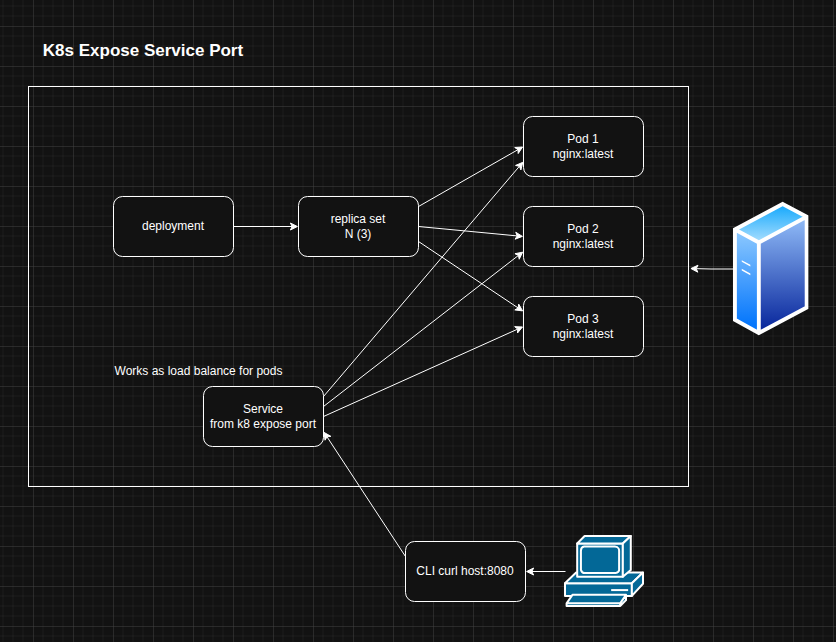

# Kubernetes

- [Configs files](./k8_ymls_configs.md)
- [Commands descriptions](./k8s_cli_docs.md)

<br>

<br>

### First Pod Deploy
- Create a pod config file
- Create the pod and check if is running
- k is same as kubectl
```bash
k run pod --image httpd:latest --dry-run=client -o yaml > pod.yml
nano pod.yml
k apply -f pod.yml
k get pods # kubectl get pods
```
### Expose service port
```bash
k create deploy nginx --image nginx:latest
k scale deploy nginx --replicas 3
k get rs
k expose deploy nginx --port 80 --target-port 80 --type NodePort
k get svc
kubectl exec -it [pod name] -- /bin/bash
cat > /usr/share/nginx/html/index.html
```
### Limit resources
- [Limit resources](./k8_ymls_configs.md)
```bash
k apply -f pod.yml
k describe pod [pod name]
```
### Update pods image version
Updates the container image for the "nginx-container" in the "nginx-deployment" Deployment to nginx:1.19.<br/>
This triggers a rolling update, gradually replacing old pods with new ones using the updated image.
```bash
k get deploy -o wide
# k set image deploy [deployment name] [container name]=[image name]:[version]
k set image deploy nginx-deployment nginx-container=nginx:1.19
# k rollout history deploy [deployment name]
k rollout history deploy nginx-deployment
```
### Rollback
```bash
# executes the command every sec
watch -n 1 kubectl get pods
# rollback pods
k rollout undo deploy [deploy name]
```
### Volumes and Config Map
```bash
# cm is config map
k get cm [config name] -o yaml
k get pods [pod name] -o yaml > pod.yaml
nano pod.yaml # the nginx container volume mount path
# has to be mountPath: /var/www/html
k delete pods [pod name]
k apply -f pod.yaml
k cp [file] [pod name]:/var/www/html -c [container name]
k exec -it [pod name] -c [container name] -- sh
```
